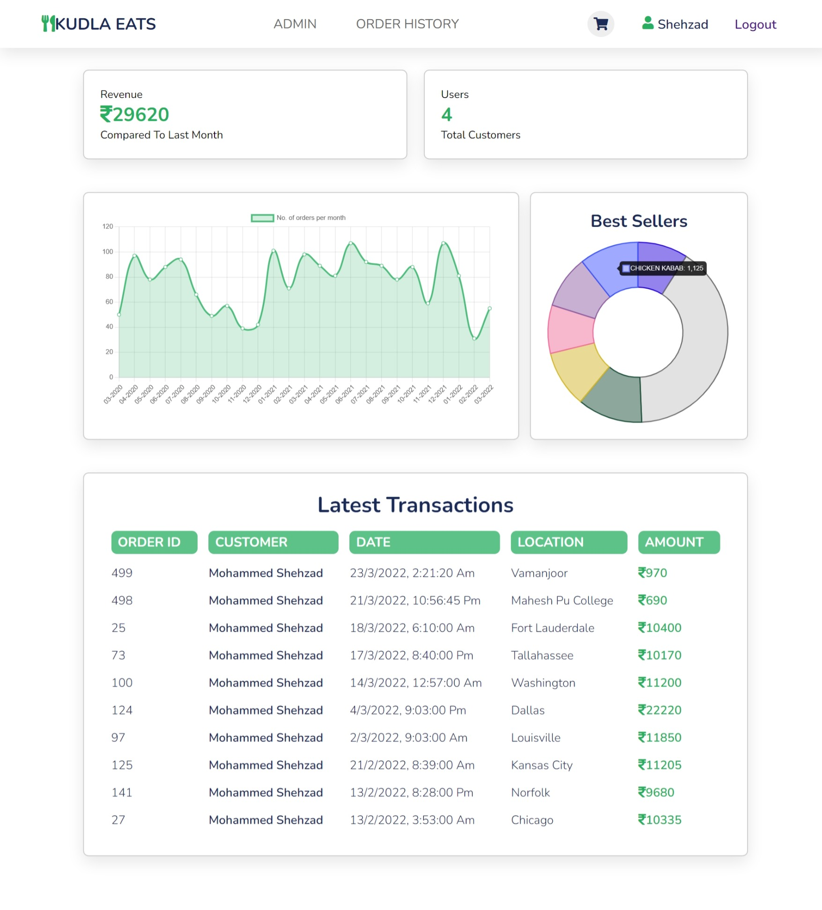

# Online Food Ordering System

This Online Food Ordering System is a web application that allows users to browse restaurant menus, place orders, and view their previous orders in a user-friendly and visually appealing interface. Additionally, the system provides an admin dashboard that offers statistical insights into monthly sales, revenue, and user data, all visualized using ChartJS.

## Project Overview

This project was developed as part of the Database Management System laboratory subject during 2nd year of university. It serves as a comprehensive example of building a web application using ExpressJS, ReactJS, MySQL, and ChartJS.

### Features

- 3NF normalized database for efficient data storage and management.
- User-friendly restaurant menu browsing and ordering system.
- virutal shopping cart that updates in real time.
- Order history for users.
- Admin dashboard for monitoring monthly sales, revenue, and user statistics.
- Interactive charts and graphs powered by ChartJS.

## Database Schema

The database schema for this project consists of 5 tables. Here's a simplified representation of the schema in the format required by the university :


## Screenshots

### Login and Registration


### Restaurant Menu


### Shopping Cart


### Order History


### Admin Dashboard


## Technologies Used

- Frontend: ReactJS
- Backend: ExpressJS
- Database: MySQL
- Data Visualization: ChartJS

## How to Run the Project
#### Requirements
- Install the required Node.js packages:
```npm install```

- Create the database with the tables specified in [Schema_creation](./backend/schema_creation.txt)
- Specify mySQL environment variables like host, user and password.
### Backend (Express.js)
1. Navigate to the `backend` directory: ```cd backend```
2. Start the server: ```node ./server.js```

### Frontend (React.js)
1. run the following command: ```npm start```

### Access the Application

You can now access the application in your web browser:

- User Interface: [http://localhost:3000](http://localhost:3000)
- Backend API: [http://localhost:4000](http://localhost:4000)

Make sure that both the backend and frontend servers are running simultaneously for the full functionality of the application.